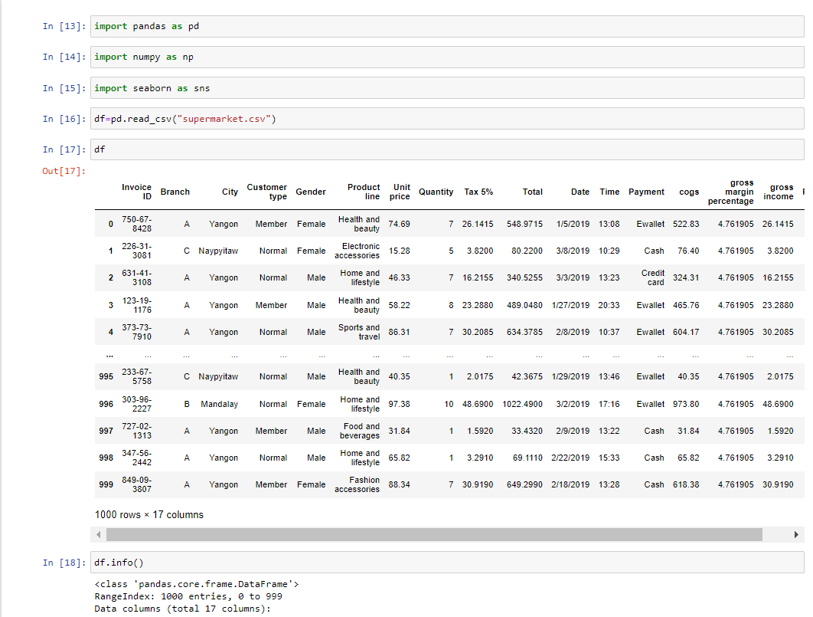
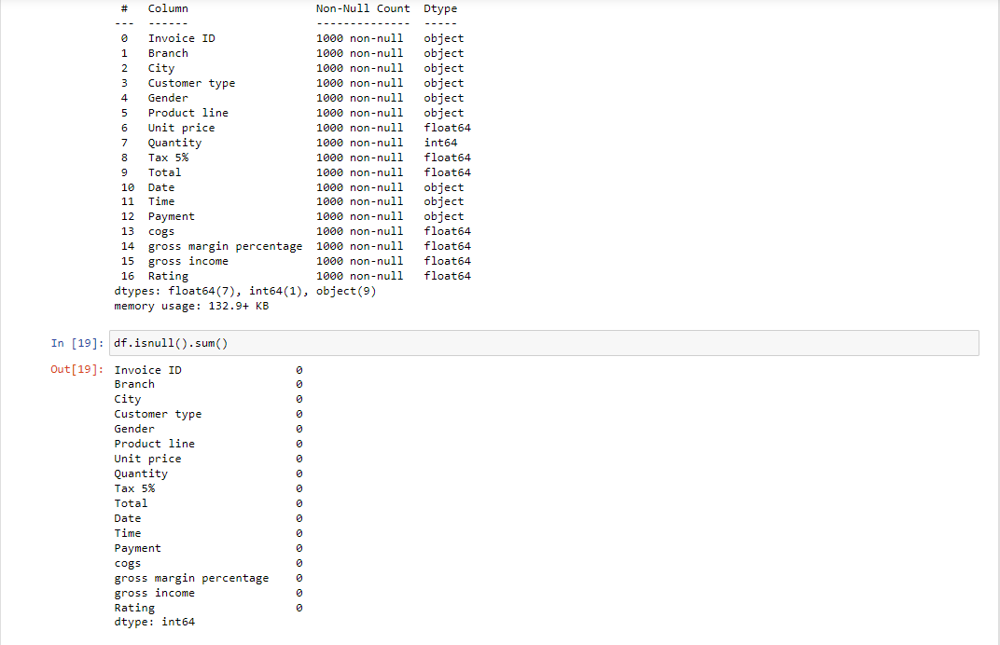
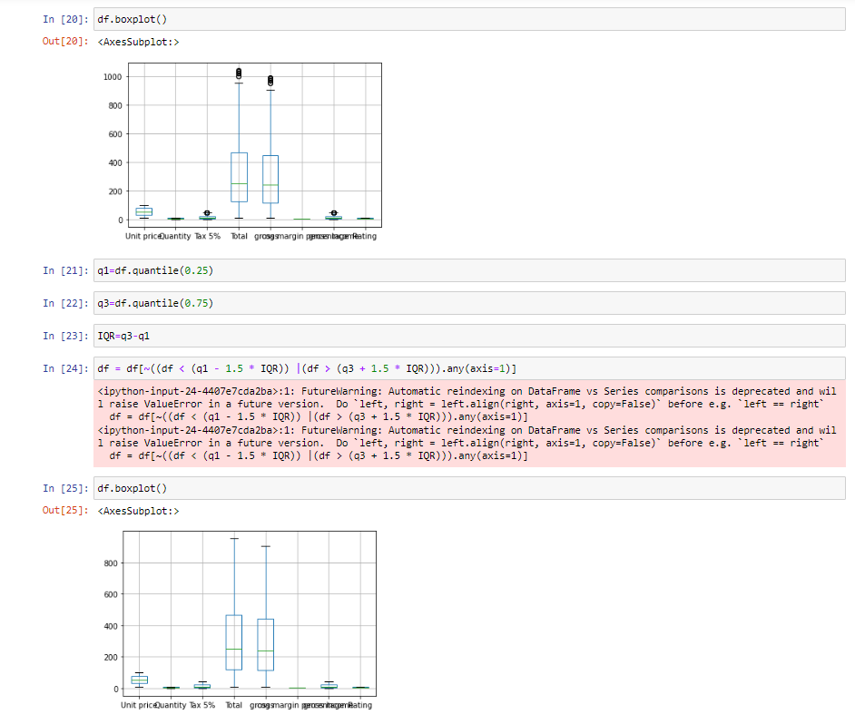
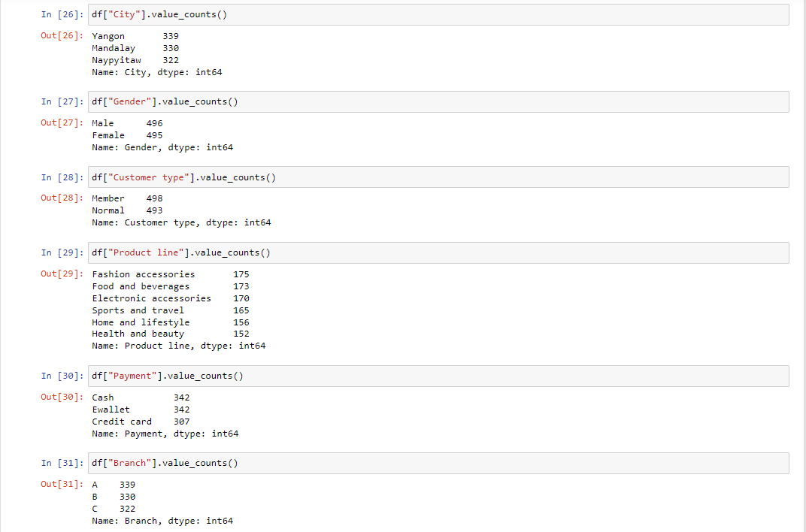
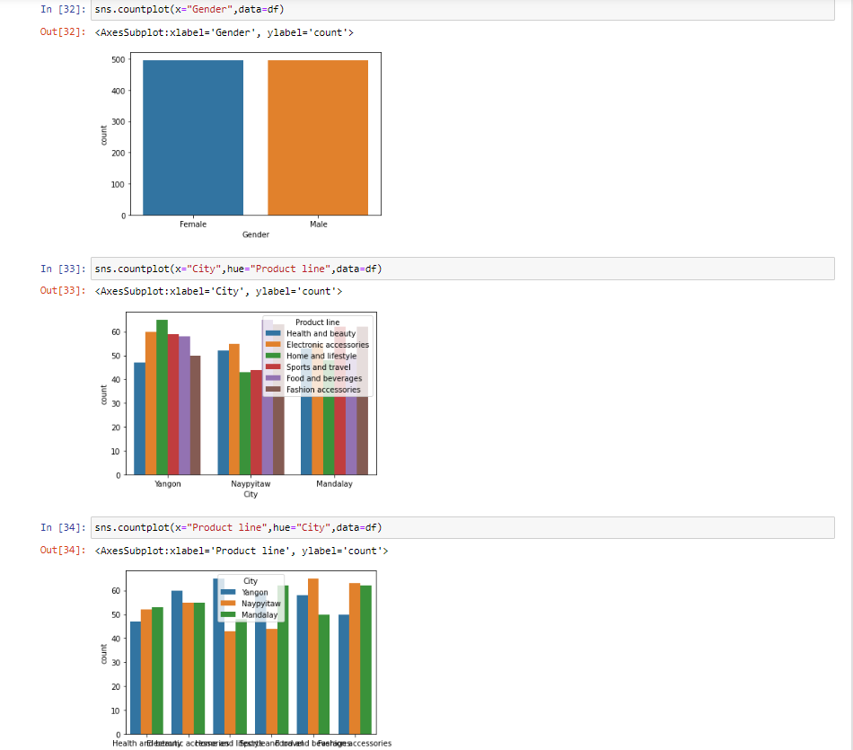
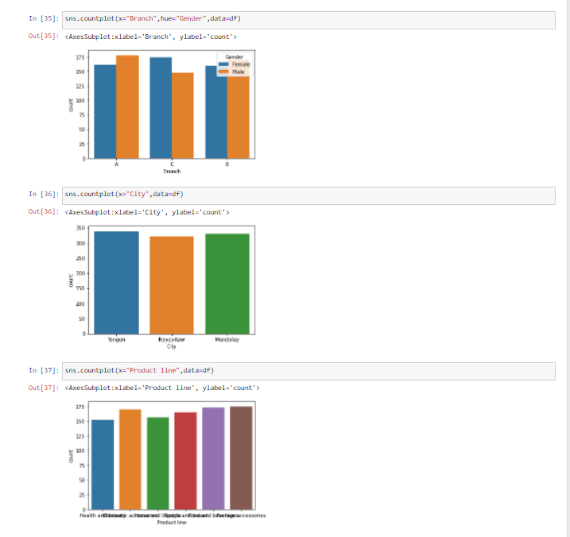
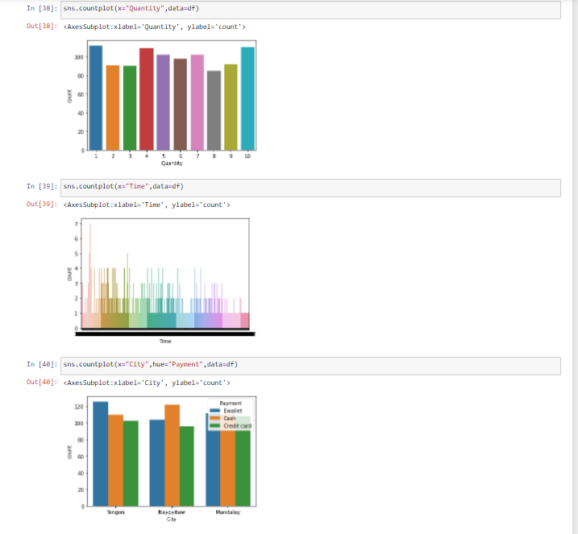
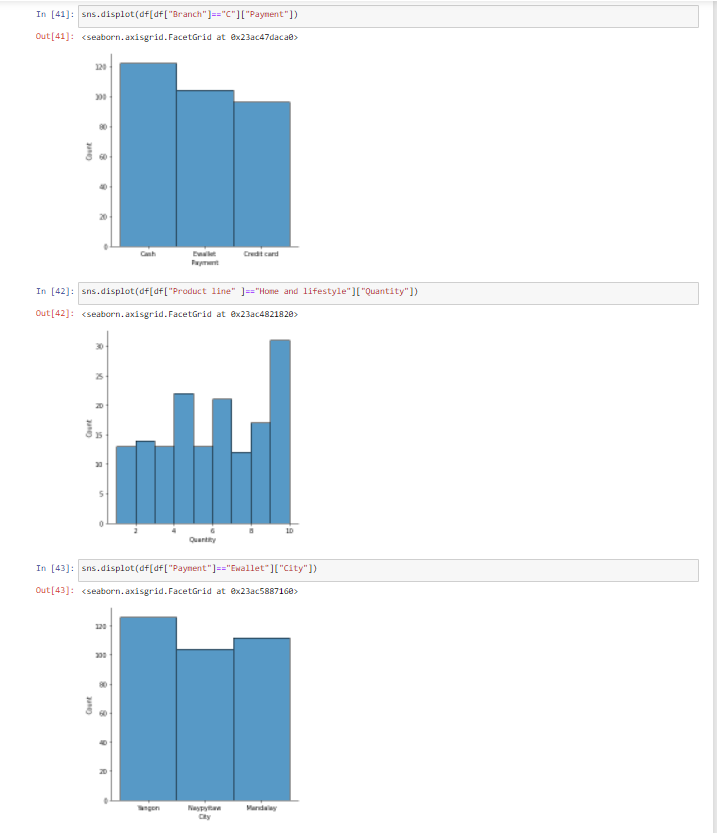
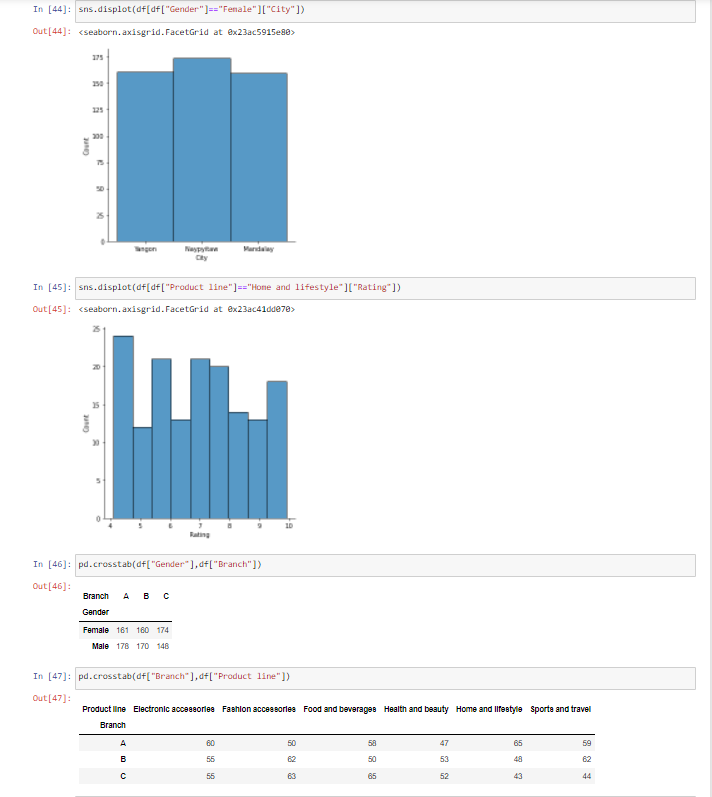
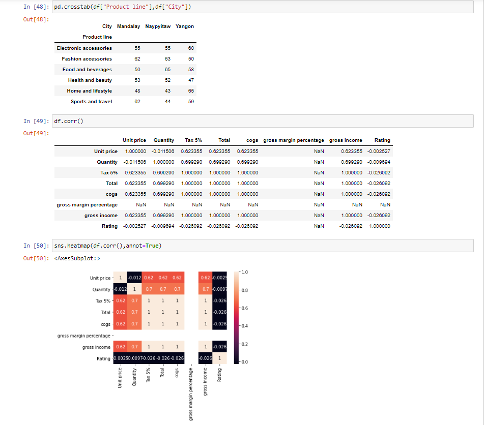

# Ex-04-EDA
AIM:
To perform EDA on the given data set.

# EXPLANATION:
The primary aim with exploratory analysis is to examine the data for distribution, outliers and anomalies to direct specific testing of your hypothesis.

# ALGORITHMS:
### STEP 1
Import the required packages(pandas,numpy,seaborn).

### STEP 2
Read and Load the Dataset

### STEP 3
Remove the null values from the data and remove the outliers.

### STEP 4
Remove the non numerical data columns using drop() method.

### STEP 5:
returns object containing counts of unique values using (value_counts()).

### STEP 6:
Plot the counts in the form of Histogram or Bar Graph.

### STEP 7:
find the pairwise correlation of all columns in the dataframe(.corr()).

### STEP 8:
Save the final data set into the file.

# CODE:
```
Developed By: KADIN SAMSON L
Register No: 212221230044

import pandas as pd 
import seaborn as sns
import matplotlib.pyplot as plt
df= pd.read_csv('supermarket.csv')
df.head()
df.info()
df.isnull().sum()
df.boxplot()
cols = ['Tax 5%', 'Total','gross margin percentage','Payment']
Q1 = df[cols].quantile(0.25)
Q3 = df[cols].quantile(0.75)
IQR = Q3 - Q1
df = df[~((df[cols] < (Q1 - 1.5 * IQR)) |(df[cols] > (Q3 + 1.5 * IQR))).any(axis=1)]
df.boxplot()
df["Total"].value_counts()
plt.title('Grouped by Total')
sns.countplot(x="Total",data=df)
df["Payment"].value_counts()
plt.title('Grouped by Payment')
sns.countplot(x="Payment",data=df)
df["City"].value_counts()
plt.title('Grouped by City')
sns.countplot(x="City",data=df)
df["Product line"].value_counts()
plt.title('Grouped by Product line')
sns.countplot(x="Product line",data=df)
sns.displot(df["Quantity"])
sns.countplot(x="Gender",hue="Product line",data=df)
sns.countplot(x="Total",hue="Customer type",data=df)
pd.crosstab(df["Total"],df["Payment"])
pd.crosstab(df["Quantity"],df["City"])
df.corr()
sns.heatmap(df.corr(),annot=True)
```
# OUTPUT:











# RESULT:
Thus the Exploratory Data Analysis (EDA) on the given data set is successfully completed.